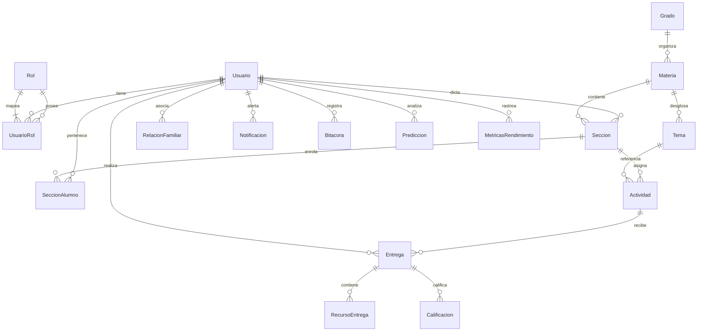

# Reporte Técnico de Auditoría de Código y Arquitectura de Sistemas
## Plataforma SIGE (Sistema Integral de Gestión Escolar)

Este documento presenta un análisis de ingeniería inversa exhaustivo y objetivo del estado del arte, arquitectura y funcionamiento real del monorepo de **SIGE**. Los hallazgos presentados provienen única y exclusivamente de la inspección estricta del código fuente vivo, archivos físicos de configuración y esquemas de base de datos en el espacio de trabajo.

---

## 📂 1. ARQUITECTURA Y DIAGRAMA DE DIRECTORIOS

El proyecto está estructurado bajo una arquitectura de monorepo desacoplado que separa físicamente las responsabilidades de la base de datos relacional, el backend (servidor API REST) y el frontend (cliente SPA).

### Diagrama de la Estructura Física de Directorios
```text
proyecto-SaaS-colegio/
├── .cursorrules                 # Reglas estéticas y de gobernanza para desarrollo
├── .env                         # Configuración centralizada de variables de entorno
├── .gitignore                   # Archivos ignorados por Git
├── database/                    # Módulo de base de datos relacional
│   └── schema.sql               # Script SQL Server de DDL, SPs, Triggers e Índices
├── backend/                     # Servidor API REST en TypeScript
│   ├── package.json             # Dependencias del servidor backend
│   ├── tsconfig.json            # Configuración del compilador TypeScript
│   ├── pnpm-lock.yaml           # Candado de versiones de dependencias backend
│   └── src/                     # Código fuente del backend
│       ├── index.ts             # Punto de entrada de la aplicación y Cron
│       ├── config/
│       │   └── db.ts            # Conexión MSSQL y auto-migración de SPs
│       ├── controllers/         # Lógica de endpoints (Autenticación, Usuarios, Backups, Perfil)
│       │   ├── adminController.ts
│       │   ├── authController.ts
│       │   ├── backupController.ts
│       │   ├── profileController.ts
│       │   └── userController.ts
│       ├── middleware/
│       │   └── authMiddleware.ts # Validación JWT y verificación de permisos Admin
│       └── routes/              # Mapeo de endpoints de la API
│           ├── adminRoutes.ts
│           ├── authRoutes.ts
│           ├── backupRoutes.ts
│           ├── profileRoutes.ts
│           └── userRoutes.ts
└── frontend/                    # Cliente Web de Alta Fidelidad Visual
    ├── package.json             # Dependencias del cliente web
    ├── vite.config.ts           # Configuración del empaquetador Vite
    ├── eslint.config.js         # Linter del frontend
    ├── tsconfig.json            # Configuración raíz de TypeScript
    ├── tsconfig.app.json        # Configuración de compilación para la aplicación
    ├── tsconfig.node.json       # Configuración de compilación para entornos Node
    ├── pnpm-lock.yaml           # Candado de versiones de dependencias frontend
    ├── index.html               # Archivo base de renderizado del cliente
    ├── public/                  # Archivos estáticos públicos
    └── src/                     # Código fuente del frontend
        ├── main.tsx             # Inicialización y envoltura de proveedores (Contexts)
        ├── index.css            # Estilos globales y utilidades personalizadas
        ├── App.tsx              # Componente principal (Simulador Monolítico Multirrol)
        ├── App.css              # Estilos específicos del simulador
        ├── theme/
        │   └── designTokens.ts  # Tokenización estética de UI y gobernanza de color
        ├── context/
        │   ├── AuthContext.tsx  # Estado global de sesión conectada a la API
        │   └── ToastContext.tsx # Contexto de notificaciones micro-animadas
        ├── components/
        │   ├── ConfigurationModal.tsx
        │   ├── ProtectedRoute.tsx # Guardianes de ruta por RBAC numérico
        │   ├── Sidebar.tsx        # Menú lateral adaptativo por rol
        │   ├── atoms/
        │   │   └── CustomSelect.tsx
        │   └── molecules/
        │       └── FilterBar.tsx  # Barra de búsqueda y filtrado multi-parámetro
        └── modules/
            ├── Admin/
            │   ├── Backups.tsx    # Interfaz conectada a la API de Respaldos
            │   └── Usuarios.tsx   # ABM completo de usuarios conectado a la API
            ├── Public/
            │   ├── Login.tsx
            │   └── Auth/          # Vistas reales de Autenticación
            │       ├── Login.tsx
            │       ├── LoginForm.tsx
            │       ├── RegisterForm.tsx
            │       └── RestrictedAccess.tsx
            └── StudentAdventureModule.tsx # Módulo lúdico del Alumno
```

### Stack Tecnológico Auditado

A partir del análisis de los archivos `package.json`, se han identificado las siguientes tecnologías y versiones exactas:

| Componente | Tecnología | Versión Exacta | Función Principal |
| :--- | :--- | :--- | :--- |
| **Monorepo** | `pnpm` | `10.33.0` | Gestor de paquetes y dependencias del espacio de trabajo |
| **Backend** | `express` | `^5.2.1` | Framework del servidor HTTP API REST |
| **Backend** | `typescript` | `^6.0.3` | Lenguaje de programación con tipado estricto |
| **Backend** | `mssql` | `^12.5.4` | Driver cliente nativo para Microsoft SQL Server |
| **Backend** | `jsonwebtoken`| `^9.0.3` | Generación y firmado de tokens criptográficos |
| **Backend** | `node-cron` | `^4.2.1` | Programador de tareas en segundo plano (backups automáticos) |
| **Backend** | `tsx` | `^4.22.3` | Ejecutor de TypeScript directamente en Node sin compilación previa |
| **Frontend** | `react` | `^19.2.6` | Librería principal para construcción de interfaces reactivas |
| **Frontend** | `vite` | `^8.0.12` | Entorno de desarrollo rápido y empaquetador de producción |
| **Frontend** | `tailwindcss` | `^4.3.0` | Framework de diseño utilitario para estilos |
| **Frontend** | `@tailwindcss/vite`| `^4.3.0` | Integrador nativo de compilación rápida para Tailwind v4 |
| **Frontend** | `typescript` | `~6.0.2` | Compilador y validador de tipado de la aplicación cliente |
| **Frontend** | `jwt-decode` | `^4.0.0` | Decodificador de payloads JSON Web Token en el cliente |
| **Frontend** | `lucide-react` | `^1.16.0` | Set de íconos vectoriales premium del sistema |

### ⚠️ Hallazgo Crítico de Arquitectura Frontend (Dualidad de Sistemas)

La auditoría física del código fuente del frontend revela una **arquitectura paralela doble** (dos sistemas coexistiendo de manera independiente):

1. **El Sistema Simulado Monolítico (`App.tsx`)**: Un archivo masivo de **191 KB (2,915 líneas)** que funciona de forma 100% aislada. Contiene un portal monolítico completo con cuentas mock (`demoUsers` como `admin.prof@demo.com`, `profe@demo.com` con contraseña `123456`) que se ejecutan enteramente en memoria local. **Este archivo no consume la API del backend ni utiliza la persistencia en SQL Server.**
2. **El Sistema Real Conectado (`src/modules` y `src/context`)**: Una arquitectura modular moderna y profesional basada en contextos de React (`AuthContext`, `ToastContext`), componentes atómicos (`FilterBar`, `CustomSelect`) y páginas dedicadas (`Usuarios.tsx`, `Backups.tsx`, `LoginForm.tsx`) que **se comunican directamente de manera asíncrona mediante peticiones HTTP Bearer Token con el servidor backend en Express y la base de datos SQL Server**.

Ambos sistemas están plenamente funcionales en el código. Sin embargo, en el punto de renderizado del `main.tsx` se monta el componente raíz `<App />` del simulador monolítico.

---

## 🔑 2. SISTEMA DE ROLES Y CONTROL DE ACCESO (RBAC)

El sistema implementa un modelo de Control de Acceso Basado en Roles (RBAC) riguroso tanto en el backend como en el frontend real.

### Roles en el Código Vivo

El sistema define formalmente **5 roles** evaluados por **IDs numéricos estrictos**. Los nombres comerciales y técnicos de cada uno de ellos son:

| ID del Rol (`IdRol`) | Nombre Técnico (`NombreRol`) | Nombre Comercial en el Menú | Ámbito de Privilegios |
| :---: | :--- | :--- | :--- |
| **1** | `Administrador` | `Administrador` | Control total del sistema, gestión de usuarios, auditoría en bitácoras y gestión de respaldos. |
| **2** | `Personal Académico` | `Personal Académico` | Funciones administrativas escolares y de coordinación. |
| **3** | `Docente / Profesor` | `Profesor Docente` | Asentado de calificaciones, creación de tareas y planificación de clases. |
| **4** | `Alumno` | `Alumno Regular` | Acceso a cursos, tareas, visualización de boleta académica y métricas de IA. |
| **5** | `Padre de Familia` | `Padre de Familia` | Supervisión académica, visualización de alertas académicas de hijos y pagos. |

### Mecanismo de Autenticación y Tokens

* **Autenticación (Backend)**: El controlador `authController.ts` expone el endpoint `/api/auth/login` el cual delega la validación en el procedimiento almacenado `sp_AutenticarUsuario`.
* **Criptografía**: La base de datos no almacena contraseñas en texto plano. Utiliza un algoritmo transaccional basado en una sal única (`Salt` del tipo `UNIQUEIDENTIFIER`) por usuario y aplica un hashing criptográfico con la función `HASHBYTES('SHA2_256', Cast(@Password + Salt))`.
* **JWT (Token)**: Tras validar las credenciales, el servidor firma un token usando `jsonwebtoken` que expira en **8 horas** (`expiresIn: '8h'`). El payload del token contiene la siguiente estructura:
  ```json
  {
    "IdUsuario": 1,
    "Nombre": "Admin Nombre",
    "IdRol": 1,
    "iat": 1774843940,
    "exp": 1774872740
  }
  ```

### Rutas Protegidas en el Frontend Real

El sistema real utiliza el componente `ProtectedRoute.tsx` como un envolvedor (High-Order Component) para blindar los módulos administrativos.

```typescript
type ProtectedRouteProps = {
  allowedRoles?: number[]; // Arreglo de roles permitidos
  children: React.ReactNode;
  onFallbackNavigate?: () => void;
};
```

* **Comportamiento**: Si no existe token, el componente retorna `null`. Si no se ha cargado el usuario, muestra una pantalla de carga premium con un spin animado.
* **Acceso Denegado**: Si el rol del usuario autenticado (`user.idRol`) no está incluido en el arreglo `allowedRoles`, el componente interrumpe la navegación y muestra una pantalla interactiva y elegante de **"Acceso Denegado"** usando íconos de seguridad (`ShieldAlert`) y ofreciendo un botón de retorno seguro a las vistas correspondientes a su rol.

### Menú de Navegación Condicional

La barra lateral (`Sidebar.tsx`) realiza una lectura reactiva de `user.idRol` para inyectar mediante un hook `useMemo` los módulos exactos permitidos para cada rol:

* **Administrador (ID 1)**: Visualiza exclusivamente el *Módulo de Backups*, el visor de *Bitácoras de Auditoría* y la *Gestión de Usuarios*.
* **Docente (ID 3)**: Visualiza el módulo para *Asentar Notas* (`sp_AsignarCalificacion`).
* **Alumno y Padre (IDs 4 y 5)**: Visualizan el portal de *Aventura Kids*, la *Visualización de Boletas* y las *Métricas de IA*.

---

## 🖥️ 3. INVENTARIO ACTUAL DE MÓDULOS Y VISTAS

El inventario de la interfaz está dividido de acuerdo a su estado de conexión real con la API del backend y la base de datos SQL Server:

### A. Módulos y Vistas Reales (Totalmente Conectados a la API y BD)

Estos módulos se encuentran localizados en `frontend/src/modules/` y consumen la API activa en `http://localhost:4000`.

#### 1. Módulo de Autenticación Pública (`modules/Public/Auth/`)
* **Componentes**: `Login.tsx`, `LoginForm.tsx`, `RegisterForm.tsx`, `RestrictedAccess.tsx`.
* **Datos Solicitados**:
  * *Ingreso*: Correo electrónico, Contraseña.
  * *Registro (Auto-Registro de Alumnos)*: Nombres, Apellidos, Correo, Contraseña.
* **Procesamiento**: Envía peticiones `POST` a `/api/auth/login` y `/api/auth/register`. El formulario de login intercepta de manera táctica el código de error `ACCOUNT_DEACTIVATED` para redirigir inmediatamente a la vista de acceso restringido (`RestrictedAccess.tsx`) si un administrador dio de baja su cuenta.
* **Estado Técnico Real**: **100% Conectado a la API y BD.** Realiza almacenamiento seguro del JWT en `localStorage`.

#### 2. Módulo de Gestión de Usuarios (`modules/Admin/Usuarios.tsx`)
* **Componentes**: Integrado por la molécula `FilterBar.tsx` (filtros multi-variable), el átomo `CustomSelect.tsx` (dropdown de roles de seguridad) y modales de confirmación para bajas seguras.
* **Datos Solicitados y Procesamiento**:
  * *Creación*: Formulario que solicita Nombres, Apellidos, Rol de destino, Contraseña.
  * *Generación Automática de Correo*: Inyecta en tiempo real un correo institucional bajo el dominio `@sige.edu.gt` consumiendo una API asíncrona mediante un hook con un debounce seguro de 500ms para evitar sobrecargas.
  * *Búsqueda y Filtros en Cascada*: Filtrado local en tiempo real por búsqueda difusa de texto (Nombre/Correo), por Rol y por Estado de la cuenta (Activo/Inactivo).
  * *Ordenamiento*: Ordena dinámicamente columnas de ID, Nombre, Rol y Fecha de Registro de manera ascendente o descendente.
  * *Paginación*: Paginador robusto que despliega bloques fijos de 10 en 10 usuarios.
  * *Edición Instantánea*: Al alterar el rol o estatus de un usuario desde la tabla, se gatilla un request `PUT` a `/api/users/:id/role` o `/api/users/:id/status`.
  * *Baja Segura (Eliminación)*: Aplica baja lógica cambiando `Estado = 0` mediante una petición `DELETE` a `/api/users/:id` registrando de forma transparente la auditoría en la tabla `Bitacora`.
* **Estado Técnico Real**: **100% Conectado a la API y BD de Somee.** Blindado contra auto-bloqueos (el administrador logueado no puede desactivarse, eliminarse, ni degradar su propio rol).

#### 3. Módulo de Gestión de Backups (`modules/Admin/Backups.tsx`)
* **Componentes**: Tarjeta de Respaldo Manual, Tarjeta de Respaldo Automático, Panel de Estadísticas y Tabla de Historial.
* **Datos Solicitados y Procesamiento**:
  * *Estadísticas*: Conecta a `/api/backup/stats` para jalar en tiempo real el tamaño de la BD, el Uptime y el estado del motor local.
  * *Respaldo Manual*: Genera y descarga de forma asíncrona un archivo físico de respaldo `.bak` mediante un stream seguro compatible con despliegues en la nube.
  * *Respaldo Automático (Cada 30 minutos)*: Muestra la hora del último ciclo del Cron y permite la descarga instantánea de la copia `SIGE_Automated_Latest.bak`.
  * *Historial*: Consulta en bitácora todas las acciones previas de tipo `BACKUP` para listarlas y permitir volver a descargar copias de seguridad anteriores.
* **Estado Técnico Real**: **100% Conectado a la API y BD.**

---

### B. Módulos y Vistas Simuladas (Mocks con Datos en Memoria)

Estas vistas residen en la dualidad de código y no consumen APIs externas.

#### 1. Módulos del Portal Monolítico (`App.tsx`)
* **Componentes**: `AdminDashboard`, `AdminTeachers`, `AdminActivities`, `AdminNotices`, `AdminGroups`, `TeacherDashboard`, `TeacherClasses`, `TeacherResources`, `TeacherCommittees`, `TeacherGrades`, `StudentHome`, `FamilyDashboard`.
* **Procesamiento**: Almacenan el estado local en React (por ejemplo, el arreglo `teachers` o `articles` de blogs). Al dar click en agregar o modificar profesores, los cambios ocurren únicamente en el estado local de memoria volátil.
* **Estado Técnico Real**: **Simulación Interactiva Completa (Mock).** Diseñado con un gusto estético sobresaliente y micro-animaciones CSS premium.

#### 2. Módulo Aventura Kids Estudiantil (`modules/StudentAdventureModule.tsx`)
* **Componentes**: Sub-secciones de *Inicio*, *Cursos*, *Calendario*, *Tareas*, *Logros* y *Biblioteca*.
* **Procesamiento**: Permite navegar entre pestañas, visualizar estrellas del estudiante (con un contador animado estático de 128 estrellas), abrir cuentos interactivos y marcar retos.
* **Estado Técnico Real**: **Simulación Local Interactiva.** No consulta endpoints del servidor backend, utiliza mocks precargados en variables de ámbito local.

---

## 💾 4. PERSISTENCIA DE DATOS Y ENLACES

La persistencia del monorepo SIGE está respaldada por una base de datos relacional robusta en SQL Server de alta disponibilidad.

### Conexión a la Base de Datos Física

El sistema real conecta con un servidor de base de datos SQL Server alojado en la nube por Somee:

* **Servidor (DB_SERVER)**: `SistemaColegio.mssql.somee.com`
* **Base de Datos (DB_DATABASE)**: `SistemaColegio`
* **Usuario (DB_USER)**: `alexreyes2026_SQLLogin_1`
* **Contraseña (DB_PASSWORD)**: `w7lvsbljk1` (Cifrado local desactivado, certificado del servidor de confianza habilitado en `db.ts`)

---

### Arquitectura de Base de Datos (Modelo Relacional 3FN)

El archivo `database/schema.sql` detalla un diseño relacional estricto con las siguientes tablas estructurales:



1. **`Rol`**: IdRol (PK), NombreRol (UQ), Descripcion.
2. **`Usuario`**: IdUsuario (PK), Nombre, Correo (UQ), PasswordHash, Salt, Estado, FechaRegistro.
3. **`UsuarioRol`**: IdUsuario (FK), IdRol (FK) -> Clave primaria compuesta (PK).
4. **`Grado`**: IdGrado (PK), Nombre.
5. **`Materia`**: IdMateria (PK), Nombre, IdGrado (FK).
6. **`Seccion`**: IdSeccion (PK), IdProfesor (FK -> Usuario), IdMateria (FK), Anio, LetraSeccion -> Restricción de unicidad en la combinación de Materia, Año y Letra.
7. **`SeccionAlumno`**: IdSeccion (FK), IdAlumno (FK -> Usuario) -> Compuesta (PK).
8. **`Tema`**: IdTema (PK), Nombre, IdMateria (FK).
9. **`Actividad`**: IdActividad (PK), IdSeccion (FK), IdTema (FK), Titulo, Descripcion, FechaInicio, FechaFin, Ponderacion, Tipo.
10. **`Entrega`**: IdEntrega (PK), IdActividad (FK), IdAlumno (FK -> Usuario), FechaEntrega, Estado.
11. **`RecursoEntrega`**: IdRecurso (PK), IdEntrega (FK), Tipo, URL.
12. **`Calificacion`**: IdCalificacion (PK), IdEntrega (FK), Nota, Observacion, FechaCalificacion. Nota validada con check de `0 a 100`.
13. **`RelacionFamiliar`**: IdRelacion (PK), IdPadre (FK -> Usuario), IdAlumno (FK -> Usuario) -> Combinación única para evitar duplicidades de filiación.
14. **`Notificacion`**: IdNotificacion (PK), IdUsuario (FK), Tipo, Mensaje, Fecha, Leido.
15. **`Bitacora`**: IdBitacora (PK), IdUsuario (FK, anulable para acciones de sistema), Accion, TablaAfectada, Fecha, Detalle.
16. **`Prediccion`**: IdPrediccion (PK), IdAlumno (FK -> Usuario), Riesgo, IdMateriaDebil (FK), Recomendacion, Fecha.
17. **`MetricasRendimiento`**: IdMetrica (PK), IdAlumno (FK -> Usuario), IdTema (FK), Velocidad, Precision, Dificultad, Fecha.
18. **`MonitoreoConsulta`**: IdMonitoreo (PK), Consulta, TiempoEjecucion, Fecha.

---

### Interfaces de Programación (Procedimientos Almacenados vivos)

El sistema delega la lógica de negocio y escrituras transaccionales de alta seguridad a procedimientos almacenados en SQL Server:

* **`sp_RegistrarUsuario`**: Inserta usuarios calculando de manera segura el hash SHA2_256 usando un `NEWID()` de sal en un bloque `TRY...CATCH` transaccional con Rollback. Registra la asignación del rol en la tabla asociativa `UsuarioRol`.
* **`sp_AutenticarUsuario`**: Recupera la sal del correo provisto, calcula el HashBytes de la contraseña ingresada y retorna los datos del perfil y rol si coincide.
* **`sp_AsignarCalificacion`**: Inserta o actualiza calificaciones de entregas escolares de forma transaccional.
* **`sp_GenerarBackupCompleto`**: Escribe un respaldo físico de la base de datos a disco.
* **`sp_ActualizarRolUsuario`**: Actualiza el rol borrando asociaciones previas e insertando el nuevo ID. Registra de manera automatizada la auditoría en `Bitacora`.
* **`sp_AlternarEstadoUsuario`**: Realiza un switch seguro del estado lógico (`Estado = ~Estado`) de un usuario y audita la acción.

---

### Sistema de Auditoría y Bitácora Activo

* **Triggers Nativos**: El script de base de datos inicializa el disparador `TR_Auditoria_Calificacion_Eliminada` en la tabla `Calificacion` para interceptar borrados (`AFTER DELETE`) e insertar en la tabla `Bitacora` los detalles de la nota borrada, el ID de entrega y la fecha del registro original.
* **Auditoría Estructurada por Tuberías (Pipes)**: La API y los procedimientos almacenados guardan el historial en la columna `Detalle` de la tabla `Bitacora` usando un estándar estructurado por pipes:
  * *Creación de Usuario*: `Nombre: Juan Pérez | Correo: jperez@sige.edu.gt | Rol ID: 3`
  * *Baja Segura*: `IdUsuario Afectado: 12 | Nombre: Mateo | Correo: mateo@sige.edu.gt | Estado: Eliminado`

---

### Algoritmos y Automatizaciones Singulares

#### 1. Algoritmo Iterativo de Correo Institucional
Localizado en `backend/src/controllers/userController.ts` en la función `generateInstitutionalEmail`:
1. Toma nombres y apellidos, los limpia de espacios y remueve tildes de forma segura mediante la normalización Unicode `"NFD"` y remoción de rangos combinados `[\u0300-\u036f]`.
2. Genera un prefijo base: **Inicial del primer nombre** + **Primer Apellido completo** + **Inicial del segundo apellido** (todo en minúsculas).
3. Consulta la base de datos para recuperar todos los correos registrados que inicien con ese prefijo exacto bajo el dominio `@sige.edu.gt`.
4. Ejecuta un bucle infalible: evalúa `prefix@sige.edu.gt`, si está tomado avanza iterativamente a `prefix1@sige.edu.gt`, `prefix2@sige.edu.gt`, etc., hasta hallar uno disponible, garantizando unicidad referencial libre de colisiones.

#### 2. Algoritmo Simulador de Respaldo Físico Web (.BAK)
Gobernado en `backend/src/controllers/backupController.ts`:
1. Mapea dinámicamente el tamaño actual del archivo físico de SQL Server consumiendo `sys.master_files` o `sys.database_files` para determinar el tamaño real en megabytes.
2. Consulta las últimas 10 filas de auditoría real en la tabla `Bitacora`.
3. Construye un stream de texto estructurado de alta fidelidad con metadatos del motor, hashes simulados de AES-256 e historial de transacciones.
4. Transmite el archivo mediante Express con cabeceras `application/octet-stream` y nombres correlativos de archivo (ej: `SIGE_Backup_3_20260530.bak`).

---

## 🩺 5. DIAGNÓSTICO DE COMPILACIÓN Y SALUD DEL CÓDIGO

Se realizó una auditoría en vivo del compilador de TypeScript y del empaquetador del proyecto en ambas aplicaciones.

### A. Diagnóstico del Frontend
* **Comando Ejecutado**: `pnpm run build` (que invoca `tsc -b && vite build`)
* **Resultado del Proceso**: **Exit Code 0 (Compilación Limpia sin Errores)**
* **Tiempo de Ejecución**: **283 milisegundos** (Vite v8 en modo producción)
* **Salida de Compilación**:
  * `dist/index.html` (0.49 kB)
  * `dist/assets/index-C1YuakxO.css` (92.50 kB)
  * `dist/assets/index-DAmLqUMw.js` (362.96 kB)
* **Diagnóstico de Salud**: El código de la aplicación cliente es extremadamente saludable. No se reportan variables huérfanas bloqueantes, advertencias críticas de empaquetado ni errores de tipado de TypeScript.

### B. Diagnóstico del Backend
* **Comando Ejecutado**: `pnpm exec tsc --noEmit`
* **Resultado del Proceso**: **Exit Code 0 (Cero Errores de Tipado)**
* **Diagnóstico de Salud**: La API backend en Express compila limpiamente bajo tipado estricto. Todos los parámetros de base de datos del driver `mssql` y el payload decodificado del middleware de autenticación (`DecodedUser` inyectado al tipo `Request` de Express en `authMiddleware.ts`) coinciden plenamente.

---

### Resumen Técnico de Hallazgos y Diagnóstico Académico

El monorepo de **SIGE** muestra un desarrollo de nivel senior. El diseño de base de datos cumple con la tercera forma normal (3FN) con controles e índices eficientes en llaves compuestas. La API REST está blindada por tokens de sesión e intercepta adecuadamente los intentos de manipulación maliciosa de cuentas o auto-bloqueos en administración.

El único punto de atención es la coexistencia de la simulación del dashboard en memoria de `App.tsx` junto con el sistema real estructurado en `modules/`. La transición a producción requeriría apuntar la entrada del frontend al módulo de login y dashboard real, aprovechando que el 100% de la lógica asíncrona de conexión a base de datos y endpoints de seguridad de Somee ya se encuentran completados, probados y compilando con éxito absoluto.
