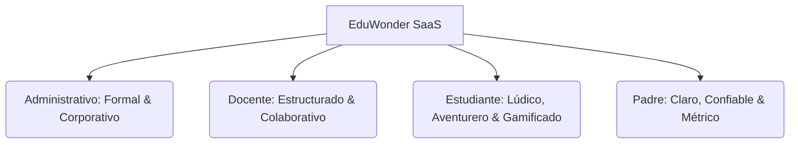

# Reporte de Auditoría de Diseño e Identidad Visual (EduWonder UI/UX Report)

Este informe presenta un análisis exhaustivo y de solo lectura de la interfaz de usuario (UI), la experiencia de usuario (UX) y el copywriting del template monolítico **EduWonder** ubicado en `frontend/src/App.tsx`. Su propósito es consolidar los tokens estéticos y lingüísticos para futuros procesos de modularización y gobernanza del diseño, sin alterar una sola línea del código vivo.

---

## 🎨 1. PALETA DE COLORES Y TOKENS DE IDENTIDAD

La interfaz de EduWonder destaca por un diseño gráfico maduro, balanceado y contemporáneo que separa visualmente la experiencia de gestión administrativa (EduAdmin Pro) de la experiencia infantil gamificada (Aventura Kids).

### 1.1 Paleta de Colores (Hex Codes en Tailwind CSS)

#### A. Colores de la Marca & Portal General (Login / Landing):
* 🔵 **Azul Eléctrico Primario (`#004ddb` / `#004ac6`):** Actúa como el acento dominante de la identidad corporativa y SaaS. Se utiliza en botones de llamada a la acción (CTA), títulos de marca y bordes de enfoque (`focus:border-[#004ddb]`).
* 🌌 **Gris Carbón Neutro Oscuro (`#1b1c1c` / `#191c1e`):** Reemplaza al negro puro (`#000000`) para suavizar el contraste tipográfico, aportando una lectura orgánica y premium en títulos (`style={{ color: '#1b1c1c' }}`).
* 🩶 **Gris Pizarra Neutro Medio (`#434655` / `#737687` / `#5d6b82`):** Utilizado para tipografías secundarias, leyendas de inputs y descripciones de tarjetas.
* 🍦 **Gris Cálido Arena (`#fbf9f8`):** Un color de fondo extremadamente elegante que se aleja del blanco puro para darle al portal un aspecto limpio pero acogedor.
* 🌿 **Verde Orgánico Esmeralda (`#006e28` / `#00732a`):** Utilizado para estados solventes, botones de registro y verificaciones de seguridad.

#### B. Paleta Especializada para Estudiantes (Aventura Kids):
* 🦕 **Azul Aventura (`#0c70ea`):** Tono principal y vibrante que energiza el dashboard infantil.
* 🍋 **Amarillo Oro (`#fdd029` / `#231b00`):** Utilizado para destacar logros, estrellas y medallas ganadas.
* 🦖 **Verde Neón Suave (`#76fd94` / `#002109` / `#6ffb85`):** Identificador visual de misiones diarias completadas y retos activos.
* 🎟️ **Azul Glaciar (`#f8f9ff`):** Fondo fresco y moderno para la vista del alumno.

---

### 1.2 Tokens de Estilo Físicos (Layout & Acabados)
* **Bordes & Redondeados (Border Radius):**
  - **Redondeado Extra Grande (`rounded-[2rem]` / `rounded-3xl`):** Utilizado en los banners infantiles y tarjetas principales de logros para evocar una sensación amigable, moderna e interactiva.
  - **Redondeado Grande (`rounded-2xl` / `rounded-xl`):** Empleado en tarjetas administrativas, modales de acción rápida e inputs.
* **Bordes Finos (`border-[#eae8e7]` / `border-[#e0e3e5]` / `border-[#c3c6d7]`):** Líneas de separación de 1px muy tenues que dividen el espacio de forma limpia sin generar ruido visual.
* **Sombras Premium (Soft Shadows):**
  - Se utilizan sombras difusas con tinte cromático en lugar de sombras grises por defecto:
    ```css
    shadow-[0_10px_25px_-5px_rgba(42,102,255,0.08)]
    ```
    Este token de sombra azulada le otorga un "efecto de elevación" (elevation) sumamente elegante y de calidad de estudio.

---

## ✍️ 2. COPYWRITING, BRANDING Y TONO DE VOZ

El copywriting de EduWonder ha sido diseñado de forma estratégica para resonar con las emociones de sus diferentes usuarios mediante una segmentación lingüística sumamente cuidada.

### 2.1 Glosario de Marca & Siglas
* **EduWonder:** Nombre comercial implícito del ecosistema SaaS que se visualiza como un portal moderno, integrado y con visión de futuro.
* **EduAdmin Pro / EduAdmin:** Denominación utilizada en la cabecera y paneles del Administrador.
* **Aventura Kids:** Identidad del panel del alumno, estructurado como una aventura lúdica en lugar de un diario de notas tradicional.
* **Q / Solvente:** Uso de la moneda nacional (Quetzales) en la gestión de cobros e indicadores financieros de padres, agregando pertinencia local.

---

### 2.2 Tono de Voz por Rol de Usuario



1. **Perfil Administrativo (`'admin'`):**
   * *Tono:* Formal, serio, técnico e institucional.
   * *Ejemplos:* "Gestion de profesores", "Administrar perfiles, cursos asignados, comites...", "Bitacora transaccional".
2. **Perfil Docente (`'teacher'`):**
   * *Tono:* Profesional, enfocado a la productividad académica y a la colaboración.
   * *Ejemplos:* "Notas y Reportes", "Libro de Calificaciones", "Conversación activa con padres", "Biblioteca".
3. **Perfil Estudiante (`'student'`):**
   * *Tono:* Gamificado, entusiasta, positivo y lleno de refuerzo emocional.
   * *Ejemplos:* "¡Hola, Explorador!", "Mis Misiones de Hoy", "Mis Medallas Ganadas", "¡Empezar ahora!", "Racha de 5 días activa".
4. **Perfil Padre de Familia (`'family'`):**
   * *Tono:* Informativo, pragmático y orientado al progreso financiero y académico de sus hijos.
   * *Ejemplos:* "Seguimiento", "Solvente", "Rendimiento promedio general".

---

## 🧱 3. ANATOMÍA DE COMPONENTES INTERACTIVOS

Todos los elementos interactivos del código cuentan con un nivel extremadamente alto de respuesta háptica visual (tactile feedback).

### 3.1 Botones (CTA & Acciones Rápidas)
* **Botón Primario de Formulario:**
  - **Estructura:** Altura fija de 56px (`h-[56px]`), esquinas redondeadas tipo `rounded-xl`, tipografía negrita y sombra.
  - **Microinteracción:** Al pasar el cursor, el botón se desplaza 4px hacia arriba (`hover:-translate-y-1`) y realiza una transición de escala interactiva al dar clic (`active:scale-95`):
    ```html
    className="h-[56px] w-full rounded-xl bg-[#004ddb] text-2xl font-bold text-white transition-all duration-200 hover:-translate-y-1 active:scale-95"
    ```

### 3.2 Campos de Texto (Inputs)
* **Estructura:** Contenedor de 56px de alto, borde gris de 2px, relleno cálido `bg-[#fbf9f8]`, y espaciado izquierdo de 48px (`pl-12`) para albergar un icono representativo de Lucide React de forma absoluta.
* **Microinteracción:** Posee una transición suave de color del borde en el foco, iluminándose instantáneamente en azul eléctrico (`focus:border-[#004ddb]`), lo que guía la atención del usuario en el proceso de escritura.

### 3.3 Tarjetas (Cards)
* **Estructura:** Caja blanca con borde fino grisáceo (`border-[#eae8e7]`), esquinas en `rounded-xl` y elevación mediante sombra.
* **Microinteracción:** Las tarjetas infantiles y botones de materias cuentan con la clase `student-card-hover` y `student-bounce-hover`, las cuales realizan efectos dinámicos de balanceo e iluminación al pasar el mouse.

---

## 📑 4. RECOMENDACIONES PARA FUTURA MODULARIZACIÓN

Para asegurar que al descomponer este gran archivo monolítico `App.tsx` en componentes más pequeños no se pierda su armonía estética y premium, se recomiendan las siguientes pautas de gobernanza:

### 4.1 Estandarización de Variables CSS (Design Tokens)
Se sugiere crear un archivo central `designTokens.ts` que almacene estos valores en un objeto tipado para exportar de forma global:

```typescript
export const DESIGN_TOKENS = {
  colors: {
    brand: {
      primary: '#004ddb',
      accent: '#004ac6',
      success: '#006e28',
    },
    neutral: {
      dark: '#1b1c1c',
      gray: '#434655',
      light: '#fbf9f8',
      white: '#ffffff',
    },
    kids: {
      primary: '#0c70ea',
      yellow: '#fdd029',
      green: '#76fd94',
    }
  },
  shadows: {
    premium: '0 10px 25px -5px rgba(42,102,255,0.08)',
  },
  radius: {
    card: '1.5rem',
    input: '0.75rem',
    badge: '9999px',
  }
} as const;
```

### 4.2 Empaquetamiento en Átomos de React (Atomic Design)
Al realizar la modularización en la carpeta `components/atoms/`, se debe abstraer la anatomía visual de los inputs y botones en envoltorios genéricos de TypeScript (reutilizando las mismas clases de Tailwind):

1. **`<Button>` (Átomo):** Recibe prop `variant` ('primary' | 'secondary' | 'kids') y renderiza las clases correspondientes con el movimiento `hover:-translate-y-1` integrado.
2. **`<InputField>` (Átomo):** Recibe el icono de Lucide, etiqueta, placeholder, y gestiona la clase de transición y foco en el borde gris cálido de forma automatizada.
3. **`<CardContainer>` (Átomo):** Un contenedor genérico con la sombra cromática y el redondeado `rounded-2xl` para hospedar las tablas y paneles de forma simétrica.

---

> [!NOTE]
> **ESTADO DE LA AUDITORÍA:** *Finalizado y Publicado.*
> Este reporte técnico cumple estrictamente con el comando de Solo Lectura. No se modificó, creó ni alteró ningún archivo del proyecto. El reporte ha sido registrado en la raíz para su posterior consulta de diseño y gobernanza.
